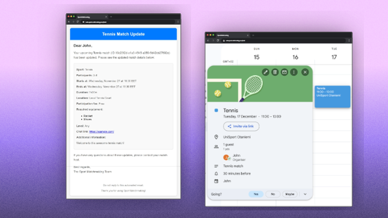

# Sport Matchmaking Web App

Sport Matchmaking is a web app that helps students and staff easily arrange, join, and discover sport matches on campus. It was designed and developed as part of the course CS-E4400 Design of WWW Services at Aalto University.


## Demo

You can visit the demo website via [https://web.sport-matchmaking.thong.cam](https://web.sport-matchmaking.thong.cam). Log-in with the following credentials:
- Username: **testuser**
- Password: **testpassword**

## Features

### 1. Host sport matches with specified time, location, minimum and maximum number of participants, skill level, and participant fee.


### 2. Update details of your sport matches.


### 3. Explore and filter matches by sport, date, and time of day.


### 4. Join upcoming matches.


### 5. Receive email notification of updates to match details. Automatically add sport matches to Google Calendar.




## Technologies

This web app is implemented using:

- [NextJS](https://nextjs.org)
- [NextAuth](https://next-auth.js.org) for authentication with [Keycloak](https://www.keycloak.org) 
- [Material UI](https://mui.com/material-ui/)
- [TailwindCSS](https://tailwindcss.com)

## How to run

Run the app as a Kubernetes service.

### Make sure required services are running

See [required services](#required-services).

### Add required environment variables

| Name                          	| Description                                   	| Example                                                               	|
|-------------------------------	|-----------------------------------------------	|-----------------------------------------------------------------------	|
| KEYCLOAK_BASE_URL             	| Base URL of Keycloak service                  	| https://keycloak.sport-matchmaking.thong.cam                          	|
| KEYCLOAK_ISSUER               	| Keycloak issuer URL for the realm             	| https://keycloak.sport-matchmaking.thong.cam/realms/sport-matchmaking 	|
| KEYCLOAK_REALM                	| Keycloak realm name (sport-matchmaking)       	| sport-matchmaking                                                     	|
| KEYCLOAK_ID                   	| ID of the Keycloak client of the front-end    	| next-auth                                                             	|
| KECYLOAK_SECRET               	| Secret of the Keycloak client                 	| 123xyz                                                                	|
| NEXT_PUBLIC_MATCH_SERVICE_URL 	| URL of the match service                      	| https://match-service.sport-matchmaking.thong.cam                     	|
| NEXTAUTH_URL                  	| URL for authentication (${base_url}/api/auth) 	| https://web.sport-matchmaking.thong.cam/api/auth                      	|
| AUTH_SECRET                   	| Random secret for production Next Auth        	| 123xyz                                                                	|


Add required environment variables through creating a secret called `sport-matchmaking-frontend-secrets`, for example using the following command:

```bash
kubectl create secret generic sport-matchmaking-frontend-secrets
  --from-literal=key1=value1 \
  --from-literal=key2=value2
```

### Add match service URL

Edit `./app/lib/definitions.ts`, line 10:

```TypeScript
export const matchServiceURL = "https://match-service.sport-matchmaking.thong.cam" // Replace with your match service URL. 
```

### Build Docker image

```Bash
docker build -t sport-matchmaking-frontend .
```

Optionally push the image to your Container Image Repository of choice.

### Run on Kubernetes

Edit `./kubernetes/ingress.yaml` to set correct ingress for your service.

Run the service with 

```bash
kubectl apply -f ./kubernetes/
```

## Required services

This web app depends on these services:

- Match service: Manages matches and participations [[link]](https://github.com/sneaktricks/sport-matchmaking-match-service).
- Keycloak service: User management and authentication [[link]](https://www.keycloak.org).

### Other services

- Notification service: Handles match notifications via email [[link]](https://github.com/sneaktricks/sport-matchmaking-notification-service).
- Google Calendar service: Handles Google Calendar integration [[link]](https://github.com/jiaw1/sport-matchmaking-google-calendar-service).
- Auth service: Handles log-in/log-out/registration flow [[link]](https://github.com/jiaw1/sport-matchmaking-auth-service).

### Example production architecture


## Development

Add [required environment variables](#add-required-environment-variables) to `.env` file at root directory.

To start the development server, run:

```bash
npm run dev
# or
yarn dev
# or
pnpm dev
# or
bun dev
```

Open [http://localhost:3000](http://localhost:3000) with your browser to see the result.

## Known issues

🚧 Users have to click on the log-in button twice on Safari iOS. First attempt always fails.

🚧 UI components sometimes fail to update to new state after user actions (e.g. joining match).

🚧 Fail to logout users after authentication token expiry.

## Learn More

To learn more about Next.js, take a look at the following resources:

- [Next.js Documentation](https://nextjs.org/docs) - learn about Next.js features and API.
- [Learn Next.js](https://nextjs.org/learn) - an interactive Next.js tutorial.

You can check out [the Next.js GitHub repository](https://github.com/vercel/next.js) - your feedback and contributions are welcome!
